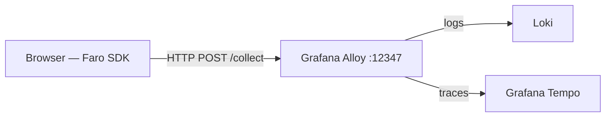
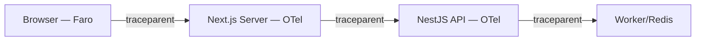

Aplicação frontend desenvolvida com **Next.js v15**.

## Começando

Primeiro, execute o servidor de desenvolvimento:

```bash
pnpm dev
```

Abra [http://localhost:3000](http://localhost:3000) no seu navegador para ver o resultado.

Você pode começar a editar a página modificando `app/page.tsx`. A página é atualizada automaticamente conforme você edita o arquivo.

Este projeto utiliza [`next/font`](https://nextjs.org/docs/app/building-your-application/optimizing/fonts) para otimizar e carregar automaticamente a [Geist](https://vercel.com/font), uma nova família de fontes da Vercel.

## Configuração e Variáveis de Ambiente

Esta aplicação utiliza um sistema de configuração centralizado. **Não edite ou crie arquivos `.env` manualmente neste diretório.**

### Fluxo de Configuração:

1.  **Fonte da Verdade**: Todas as configurações vivem no arquivo `config.yaml` na raiz do monorepo.
2.  **Validação**: O pacote `@turborepo/config` valida este arquivo usando Zod.
3.  **Geração Automática**: Antes de iniciar (`dev` ou `build`), o script `generate-frontend-env` é executado.
4.  **Consumo**: Este script cria um arquivo `.env` local com as variáveis necessárias já prefixadas com `NEXT_PUBLIC_`.

### Como adicionar novas variáveis:

1. Adicione a variável no `config.yaml` (raiz do repo).
2. Adicione a validação no schema em `packages/config/src/index.node.ts` (ou arquivo de schema correspondente).
3. Se a variável for necessária no Browser, adicione o nome dela à lista de exportação em `packages/config/src/generate-frontend-env.ts`.
4. Execute `pnpm dev` e o arquivo `.env` será atualizado automaticamente.

### Observabilidade e Tracing:

O frontend adota uma arquitetura **híbrida** de observabilidade:

| Camada                         | SDK                   | Destino                                |
| ------------------------------ | --------------------- | -------------------------------------- |
| Browser (client-side)          | **Grafana Faro SDK**  | Grafana Alloy (porta `12347`)          |
| Servidor Node.js (SSR/RSC/API) | **OpenTelemetry SDK** | OpenTelemetry Collector (porta `4318`) |

- O Faro SDK é ativado se `NEXT_PUBLIC_FARO_URL` estiver definido.
- O OTel server-side é ativado se `NEXT_PUBLIC_OTEL_ENABLED="true"`.
- As configurações de endpoint são gerenciadas via `config.yaml`.

### Como funciona

1.  **`config.yaml`**: A única fonte da verdade para toda a configuração do monorepo.
2.  **Geração Automática de `.env`**: Ao executar `pnpm dev` ou `pnpm build`, o script `generate-frontend-env` do `@turborepo/config` é acionado. Ele valida o `config.yaml` contra o schema (Zod) e gera um arquivo `.env` na raiz do frontend.
    - **Importante**: Se qualquer variável obrigatória (mesmo as do frontend) estiver faltando no `config.yaml`, o build irá falhar.
3.  **Variáveis Públicas**: Apenas variáveis que estiverem **explicitamente anotadas** como seguras para o frontend em `packages/config/src/schema.ts` (`EnvAnnotations`) serão incluídas no `.env` gerado. Mesmo chaves com o prefixo `NEXT_PUBLIC_` **devem** ser anotadas para serem exportadas; isso garante que cada exportação seja uma decisão deliberada e documentada.
4.  **Código da Aplicação**: Utiliza o ponto de entrada seguro do `@turborepo/config` que lê do `process.env` (alimentado pelo `.env` gerado), garantindo compatibilidade com Browser e Edge Runtime.

### Fluxo de Trabalho

- **Local**: O arquivo `.env` é gerado automaticamente via hooks `predev` e `prebuild`.
- **CI/CD**: O build falha se a configuração estiver inconsistente.
- **Segurança**: O arquivo `.env` gerado é ignorado pelo Git (definido no `.gitignore`).

### Adicionando novas variáveis

1.  Adicione a variável ao `config.yaml` (e `config.example.yaml`).
2.  Atualize o schema em `packages/config/src/schema.ts`.
3.  Se a variável precisar ser acessível no Browser, use o prefixo `NEXT_PUBLIC_` (ex: `frontend_meu_valor` -> `NEXT_PUBLIC_MEU_VALOR`).
4.  Rode `pnpm dev` para regerar o `.env`.
5.  A variável estará automaticamente disponível no frontend via `typedEnv` (importado de `@turborepo/config`).

**Nota:** Variáveis destinadas ao lado do cliente (navegador) devem ser prefixadas com `NEXT_PUBLIC_`.

## Autenticação e Segurança

A aplicação utiliza **NextAuth.js (Auth.js v5)** para gerenciar a autenticação, integrada com um backend NestJS.

### Fluxo de Autenticação

1.  **Login**: O usuário fornece credenciais (email/senha) que são validadas pelo backend.
2.  **JWT (JSON Web Token)**: Após o login bem-sucedido, o backend retorna um `accessToken` e um `refreshToken`.
3.  **Sessão**: O NextAuth armazena esses tokens em um cookie seguro e criptografado no lado do cliente.
4.  **Refresh Token**: A aplicação monitora a expiração do `accessToken`. Quando expirado, ela tenta renová-lo automaticamente usando o `refreshToken` sem deslogar o usuário.

### Requisitos de Segurança Cobertos

- **Cookies HTTP-Only**: Os tokens de sessão são armazenados em cookies protegidos contra ataques XSS (Cross-Site Scripting).
- **Proteção CSRF**: O NextAuth inclui proteção nativa contra Cross-Site Request Forgery.
- **Middleware de Proteção**: Todas as rotas (exceto login e arquivos estáticos) são protegidas por padrão via `middleware.ts`.
- **Validação de Esquema**: As credenciais são validadas no frontend usando **Zod** antes de serem enviadas ao servidor.
- **Isolamento de Variáveis**: Segredos sensíveis (como `FRONTEND_AUTH_SECRET`) nunca são expostos ao navegador, permanecendo apenas no ambiente do servidor.
- **Tipagem Forte**: O uso de TypeScript garante que os papéis (roles) e permissões do usuário sejam tratados de forma consistente em toda a aplicação.

### Proteção de Rotas e Navegação

A aplicação implementa um sistema de proteção de rotas em múltiplas camadas para garantir que usuários não autenticados não visualizem conteúdo privado:

- **Proxy (Edge Layer)**: O arquivo `src/proxy.ts` (substituto do antigo `middleware.ts`) intercepta todas as navegações. Ele utiliza a callback `authorized` definida em `src/auth.ts` para verificar a sessão. Se um usuário não autenticado tentar acessar uma rota privada, ele é redirecionado automaticamente para `/login`.
- **Server-Side Layout Guard**: O layout principal das rotas autenticadas (`src/app/(authenticated)/layout.tsx`) reforça a segurança no lado do servidor. Ele verifica a existência da sessão antes de renderizar qualquer conteúdo filho. Isso evita que o estado da UI de uma página privada seja "vazado" durante o carregamento ou após o logout.
- **Rotas Públicas vs Privadas**:
  - **Públicas**: `/`, `/login`, e rotas de API de autenticação (`/api/auth/*`).
  - **Privadas**: Qualquer rota dentro do diretório `src/app/(authenticated)/` (ex: `/dashboard`, `/admin`, `/documents`).

## Observabilidade (Logs e Tracing)

A aplicação implementa observabilidade em duas camadas independentes: **Grafana Faro** no browser e **OpenTelemetry** no servidor Node.js.

### Logging

Utilizamos `pino` (via `@turborepo/logging`) para logging estruturado no lado do servidor.

- **Desenvolvimento**: Logs formatados e coloridos (`pino-pretty`) no terminal.
- **Produção**: Logs em JSON para ingestão no Loki.
- **Isomorfismo**: O logger em `src/lib/logger.ts` detecta automaticamente o ambiente. No Browser, utiliza `console` para não inflar o bundle; no Servidor, utiliza o pacote de logging robusto.

### Browser — Grafana Faro SDK

O componente `OtelProvider` (em `src/components/otel-provider.tsx`) inicializa o **Grafana Faro SDK** de forma assíncrona (dynamic import), apenas no browser.

O Faro captura automaticamente, sem código adicional:

- Erros não tratados com stack trace completa.
- `console.error` / `console.warn`.
- Web Vitals: LCP, INP, CLS, FCP, TTFB.
- Navegações SPA.
- Traces distribuídos browser → servidor via header W3C `traceparent`.

#### Variáveis de ambiente (browser):

| Variável                        | Descrição                                                                                               |
| ------------------------------- | ------------------------------------------------------------------------------------------------------- |
| `NEXT_PUBLIC_FARO_URL`          | Endpoint do Grafana Alloy — ex: `http://localhost:12347/collect`. Se ausente, o SDK não é inicializado. |
| `NEXT_PUBLIC_OTEL_SERVICE_NAME` | Nome do app no Faro (e OTel).                                                                           |
| `NEXT_PUBLIC_APP_VERSION`       | Versão da aplicação (embed nas sessões Faro).                                                           |
| `NEXT_PUBLIC_ENV`               | Ambiente — `development` ou `production`.                                                               |

#### Infraestrutura (Grafana Alloy):

O Alloy atua como receptor nativo Faro. A configuração está em `docker/alloy-config.alloy`. O serviço **não está** no `docker-compose-dev.yml` e deve ser provisionado externamente (ou adicionado ao compose do ambiente de monitoramento).



### Servidor — OpenTelemetry Node.js SDK

O arquivo `src/instrumentation.ts` (hook nativo do Next.js) inicializa o OTel SDK para o runtime Node.js — cobre SSR, RSC, Route Handlers e Middleware.

#### Recursos cobertos:

- Traces HTTP automáticos (requests recebidos e chamadas `fetch` de saída).
- Métricas de runtime (CPU, memória).
- Logs estruturados via `pino` integrado ao OTel SDK.
- **`crash-monitor`** (`src/lib/crash-monitor.ts`): contador de métricas `process.crashes` para erros fatais (`uncaughtException` / `unhandledRejection`).

#### Variáveis de ambiente (servidor):

| Variável                               | Descrição                                                                               |
| -------------------------------------- | --------------------------------------------------------------------------------------- |
| `NEXT_PUBLIC_OTEL_ENABLED`             | Habilita o OTel server-side.                                                            |
| `FRONTEND_OTEL_SERVICE_NAME`           | Nome do serviço (ex: `frontend-server`).                                                |
| `FRONTEND_OTEL_EXPORTER_OTLP_ENDPOINT` | Endpoint OTLP/HTTP (porta `4318`) — tem prioridade sobre `OTEL_EXPORTER_OTLP_ENDPOINT`. |
| `FRONTEND_OTEL_EXPORTER_OTLP_PROTOCOL` | Protocolo — padrão `http/protobuf`.                                                     |
| `LOG_EXPORTER_ENABLED`                 | Habilita exportação de logs para o Collector.                                           |

#### Propagação de contexto (servidor → backend):

O utilitário `apiFetch` propaga o header `traceparent` nas chamadas ao NestJS. Se o contexto automático do OTel for perdido (comum no App Router), o `apiFetch` usa fallback via `next/headers` para garantir continuidade do trace.



#### Configuração técnica:

- **`next.config.ts`**: Configurado com `serverExternalPackages` para pacotes OTel e logging, evitando problemas de bundling no servidor.
- **Output Standalone**: Otimizado para Docker, copiando apenas as dependências necessárias.

## Sistema de Loading Global

A aplicação implementa um sistema de carregamento unificado que lida tanto com requisições de API no lado do cliente quanto com transições de rota no lado do servidor.

### 1. Carregamento no Lado do Cliente (`apiFetch`)

Para a busca de dados no lado do cliente, utilizamos um wrapper customizado em torno da API nativa `fetch` chamado `apiFetch`. Este wrapper incrementa/decrementa automaticamente um contador de carregamento global, que ativa o componente `GlobalLoader`.

#### Regras de Uso:

- **Sempre use `apiFetch`** em vez do `fetch` nativo para qualquer chamada de API onde você deseja que o spinner de carregamento global apareça.
- O `apiFetch` é isomórfico e pode ser usado tanto em Client quanto em Server Components, mas o spinner de carregamento só será ativado quando chamado do lado do cliente (através do `LoadingProvider`).

#### Exemplo:

```tsx
import { apiFetch } from "@/lib/api-fetch";

const fetchData = async () => {
  const response = await apiFetch("/api/data");
  const data = await response.json();
  return data;
};
```

### 2. Carregamento no Lado do Servidor (`loading.tsx`)

O App Router do Next.js utiliza arquivos `loading.tsx` para exibir um estado de carregamento enquanto um segmento de rota está sendo carregado (SSR ou busca de dados no servidor).

#### Regras de Uso:

- Use `src/app/loading.tsx` para o estado de carregamento raiz.
- Você pode criar arquivos `loading.tsx` aninhados em subdiretórios para estados de carregamento mais granulares.
- **Consistência**: Sempre use o componente `GlobalLoader` dentro de seus arquivos `loading.tsx` para manter uma interface consistente.

#### Exemplo (`src/app/dashboard/loading.tsx`):

```tsx
import { GlobalLoader } from "@/components/ui/loading-spinner";

export default function Loading() {
  return (
    <div className="flex h-full items-center justify-center">
      <GlobalLoader size={40} />
    </div>
  );
}
```

### 3. Controle Manual de Loading

Se você precisar ativar o estado de carregamento manualmente (por exemplo, para operações longas no lado do cliente que não usam `fetch`), você pode usar o `useLoadingStore`.

```tsx
import { useLoadingStore } from "@/stores/loading-store";

const MyComponent = () => {
  const { start, finish } = useLoadingStore();

  const handleComplexTask = async () => {
    start();
    try {
      await someLongTask();
    } finally {
      finish();
    }
  };
};
```

## Testes

O frontend utiliza [Vitest](https://vitest.dev/) e [React Testing Library](https://testing-library.com/docs/react-testing-library/intro/).

### Executando Testes

```bash
pnpm test:run
```

### Estrutura de Testes

- **Testes Unitários**: Localizados em `src/test/stores`, `src/test/components`, etc.
- **Testes de Integração**: Localizados em `src/test/integration`.

---

**Nota sobre Strict Mode:** No ambiente de desenvolvimento (quando o `NODE_ENV` é `development`), o `React.StrictMode` do Next.js executa os efeitos (`useEffect`) duas vezes intencionalmente para ajudar a identificar problemas de limpeza (cleanup). Se você ainda visualizar duas chamadas no console/network durante o desenvolvimento após estas correções, este comportamento é esperado e não ocorrerá em produção. As correções aplicadas nos componentes de busca e listagem focam em eliminar disparos causados por lógica de estado e renderização instável.
